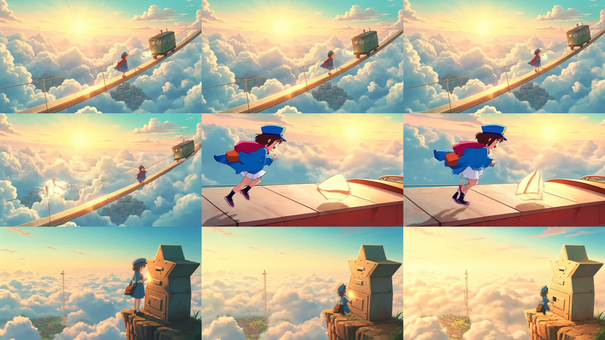

# Cloud Postgirl Runaway Star Fast

这个目录保留当前仓库中云端邮差 Fast 案例的精选示例。

案例特点：

- 使用 `MiniMax-Hailuo-2.3-Fast`
- 采用 `anchor still -> i2v` workflow
- 三段式故事主题是晨曦云海中的见习少女邮差追逐逃跑星屑包裹
- 已完成多候选配乐打分、选优与最终合成

封面说明：

- `cover.jpg` 不是单个 shot 的 contact sheet
- 它是从三个成片镜头里各抽取 3 帧后拼成的 `3 x 3` 九宫格
- 第一行对应 `shot-01`，第二行对应 `shot-02`，第三行对应 `shot-03`
- `shot-01-contact.jpg`、`shot-02-contact.jpg`、`shot-03-contact.jpg` 依然保留，作为每段镜头各自的 contact sheet

包含内容：

- `final-with-music.mp4`
  最终带配乐成片
- `sequence-preview.mp4`
  三段无声预览片
- `cover.jpg`
  三镜头九宫格关键帧总览
- `shot-01-contact.jpg`
- `shot-02-contact.jpg`
- `shot-03-contact.jpg`
  三段镜头 contact sheet
- `storyboard.md`
  三段式分镜
- `prompts.md`
  中文意图与英文生产提示词
- `music-plan.md`
  配乐规划
- `audit-summary.md`
  规划审核摘要
- `review-summary.md`
  无声版成片复盘摘要
- `candidate-summary.md`
  多候选配乐排行榜与最终选优结果
- `soundtrack-review-summary.md`
  音画适配复盘摘要
