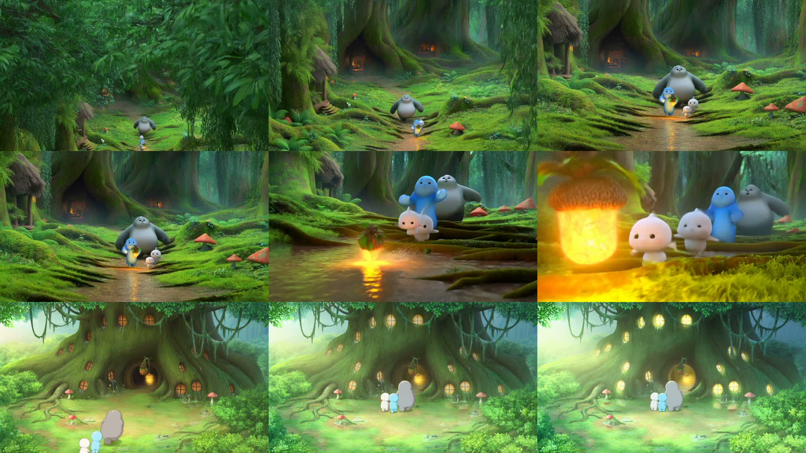

# Forest Spirit Family Dawn Lantern

这个目录保留当前仓库中森林精灵一家人主模式案例的精选示例。

案例特点：

- 使用 `MiniMax-Hailuo-2.3`
- 规格为 `768P / 6s / 3 shots`
- 三段式结构是“建立 -> 追逐升级 -> 温暖归家收束”
- `shot-02` 使用 `i2v` 承接 `shot-01` 末帧，保证角色与路径连续
- 已完成配乐审核、音乐生成、混音与音画复盘

封面说明：

- `cover.jpg` 是 `3 x 3` 关键帧总览
- 第一行对应 `shot-01`，第二行对应 `shot-02`，第三行对应 `shot-03`
- `shot-01-contact.jpg`、`shot-02-contact.jpg`、`shot-03-contact.jpg` 依然保留，作为每段镜头各自的 contact sheet

包含内容：

- `final-with-music.mp4`
  最终带配乐成片
- `sequence-preview.mp4`
  三段无声预览片
- `cover.jpg`
  三镜头九宫格关键帧总览
- `shot-01-contact.jpg`
- `shot-02-contact.jpg`
- `shot-03-contact.jpg`
  三段镜头 contact sheet
- `storyboard.md`
  三段式分镜
- `prompts.md`
  中文意图与英文生产提示词
- `music-plan.md`
  配乐规划
- `audit-summary.md`
  规划审核摘要
- `review-summary.md`
  无声版成片复盘摘要
- `soundtrack-audit-summary.md`
  配乐审核摘要
- `soundtrack-review-summary.md`
  音画适配复盘摘要
